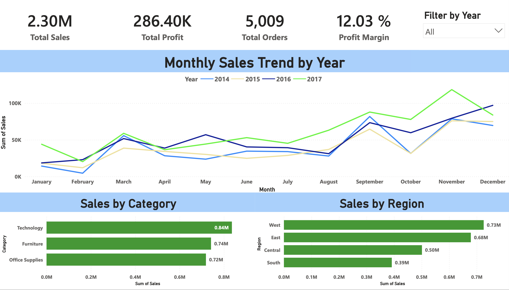
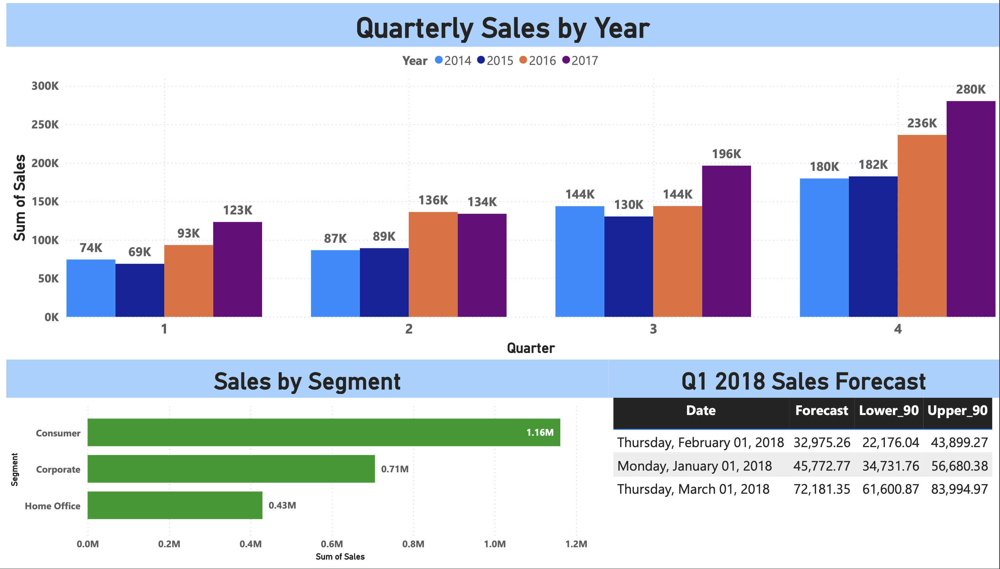
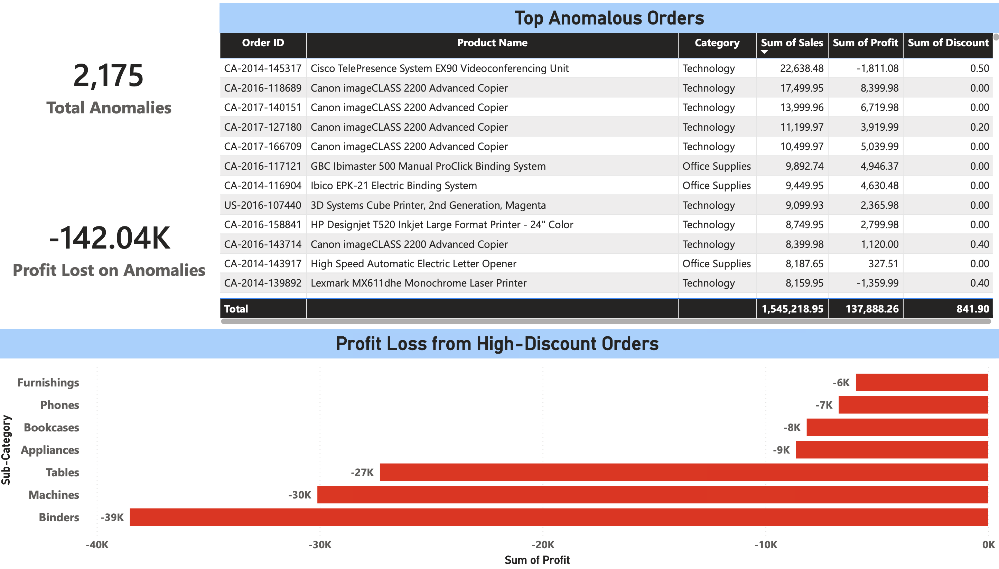
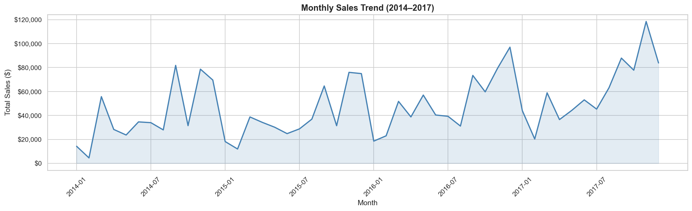
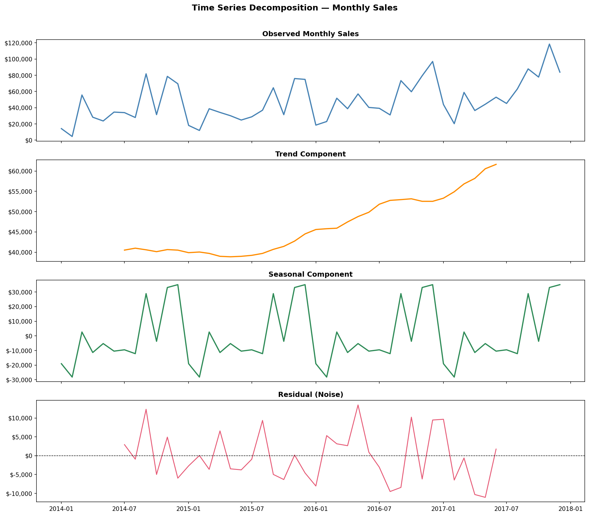
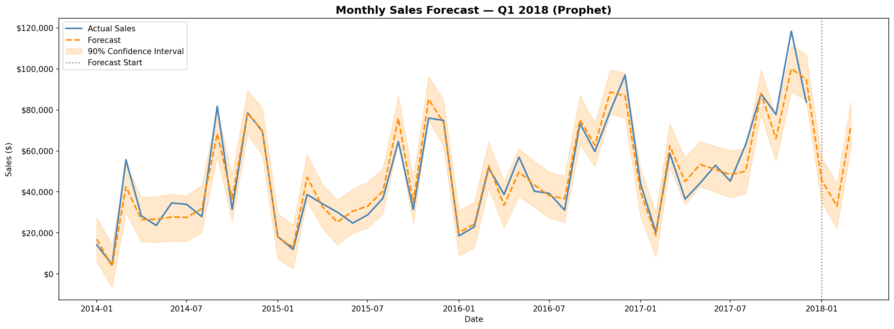
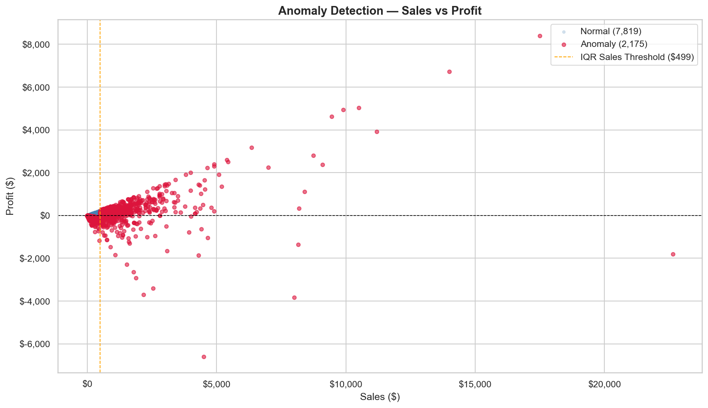
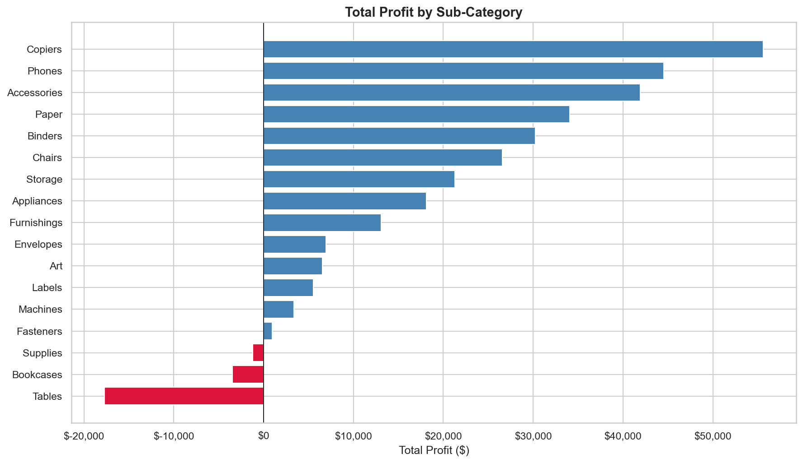

# 🛒 Retail Sales Forecasting & Anomaly Detection Dashboard


A complete end-to-end data analytics project analyzing 4 years of retail sales data to answer the business question:
**"What will Q4 revenue look like, and are there any anomalies we should investigate?"**

---

## 📊 Power BI Dashboard





> 📥 Download the full interactive dashboard: [Superstore Sales Analytics.pbix](powerbi/Superstore%20Sales%20Analytics.pbix)

---

## 🔍 Project Overview

This project uses the Kaggle Superstore Sales dataset (9,994 orders, 2014–2017) to perform a full analytics workflow including data loading, cleaning, EDA, time series decomposition, sales forecasting, and anomaly detection.

---

## 📁 Project Structure

superstore-sales-forecast/
├── data/
│   ├── raw/                  # Original CSV (not tracked in Git)
│   └── processed/            # Cleaned and transformed datasets
├── notebooks/
│   ├── 01_data_loading.ipynb
│   ├── 02_cleaning_features.ipynb
│   ├── 03_eda.ipynb
│   ├── 04_time_series.ipynb
│   ├── 05_forecasting.ipynb
│   └── 06_anomaly_detection.ipynb
├── outputs/
│   └── figures/              # All saved charts
├── powerbi/                  # Dashboard screenshots, PDF and .pbix file
└── requirements.txt

---

## 🔑 Key Findings

- **Total Sales:** $2.30M | **Total Profit:** $286K | **Profit Margin:** 12.03%
- **Q4 is consistently the strongest quarter** across all 4 years, averaging 35% above other quarters
- **Revenue grew 15.3% in 2017** and 23.6% in 2016, showing a strong upward trend
- **Q1 2018 Forecast:** $150,929 (90% CI: $118K–$185K) — expected seasonal dip after Q4 peak
- **Prophet model accuracy:** 11.5% MAPE on monthly sales forecasting
- **2,175 anomalous orders detected** (21.8% of all orders) — primarily driven by excessive discounting
- **$142K in profit lost** on anomalous orders — Binders (-$39K), Machines (-$30K), and Tables (-$27K) are the biggest loss drivers
- **Tables and Bookcases are loss-making sub-categories** despite strong sales volume
- Discounts of 70–80% account for 718 loss-making orders — a critical business risk

---

## 📈 Visualisations

### Monthly Sales Trend


### Time Series Decomposition


### Sales Forecast — Q1 2018


### Anomaly Detection


### Profit by Sub-Category


---

## 🛠️ Tech Stack

| Tool | Purpose |
|---|---|
| Python 3.13 | Core analysis language |
| Pandas & NumPy | Data manipulation |
| Matplotlib & Seaborn | Visualisations |
| statsmodels | Time series decomposition |
| Prophet (Meta) | Sales forecasting |
| SQLite | Data storage and querying |
| Power BI Service | Interactive dashboard |
| Jupyter Notebooks | Analysis environment |
| VSCode | Development environment |

---

## 🚀 How to Run

1. Clone this repository
2. Download the dataset from [Kaggle](https://www.kaggle.com/datasets/vivek468/superstore-dataset-final) and place `Sample - Superstore.csv` in `data/raw/`
3. Install dependencies:
```bash
   pip install -r requirements.txt
```
4. Run notebooks in order: 01 → 02 → 03 → 04 → 05 → 06

---

## 📦 Dataset

- **Source:** [Kaggle — Superstore Dataset](https://www.kaggle.com/datasets/vivek468/superstore-dataset-final)
- **Size:** 9,994 orders | 21 columns | 2014–2017
- **Fields:** Order details, customer info, product category, sales, profit, discount

---

## 👤 Author

**Sanju Thomas Sabu**
[LinkedIn](https://www.linkedin.com/in/sanju-thomas-sabu/) | [GitHub](https://github.com/mrthomas02)
